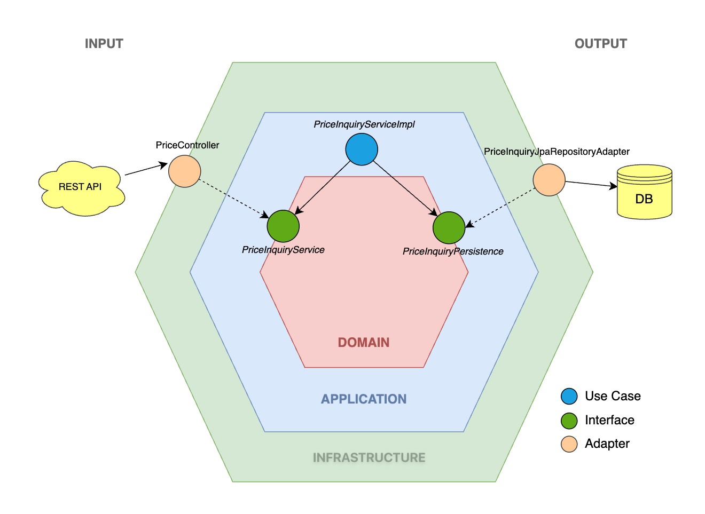

# 🛒 Ecommerce Technical Test (Spring Boot)

This project is an implementation of a REST API for querying final product prices, designed following the highest software development standards, including **Hexagonal Architecture**, **SOLID** principles, and an **API-First** approach.

---

## 📑 Table of Contents

- [🚀 Introduction](#-introduction)
- [🛠️ Technology Stack](#-technology-stack)
- [🏗️ Project Structure](#-project-structure)
- [📐 Architecture and Design](#-architecture-and-design)
- [⚙️ Setup and Execution](#-setup-and-execution)
- [🔗 Endpoints and Documentation](#-endpoints-and-documentation)
- [🧪 Testing and Quality](#-testing-and-quality)

---

## 🚀 Introduction

The application exposes a REST service that allows querying the applicable final price for a specific product, brand, and date. The business logic manages rate priority when multiple overlapping date ranges exist.

### Main Features:
- **API-First Design**: The API contract is defined first using OpenAPI.
- **Hexagonal Architecture**: Clear separation between business logic and infrastructure details.
- **Domain-Driven Design (DDD) Lite**: Use of Value Objects and domain entities to represent business logic.
- **Technical Excellence**: High test coverage and clean code.

---

## 🛠️ Technology Stack

*   **Core:** [Java 21](https://www.oracle.com/java/technologies/downloads/#java21), [Spring Boot 4.x](https://spring.io/projects/spring-boot).
*   **Dependency Management:** [Maven](https://maven.apache.org/).
*   **API Documentation:** [OpenAPI 3.0](https://swagger.io/specification/) & [SpringDoc OpenAPI](https://springdoc.org/).
*   **Persistence:** [Spring Data JPA](https://spring.io/projects/spring-data-jpa), [H2 Database](https://www.h2database.com/) (In-memory), [Flyway](https://flywaydb.org/) (Migrations).
*   **Development Tools:** [Lombok](https://projectlombok.org/), [MapStruct](https://mapstruct.org/).
*   **Quality and Testing:** [JUnit](https://junit.org/), [Mockito](https://site.mockito.org/), [Rest-Assured](https://rest-assured.io/), [JaCoCo](https://www.eclemma.org/jacoco/).
*   **AOP:** [AspectJ](https://www.eclipse.org/aspectj/) (via Spring AOP) for decoupling framework concerns.

---

## 🏗️ Project Structure

The project is modularized to ensure low coupling and high cohesion:

| Module                         | Responsibility                                                                                           |
|:-------------------------------|:---------------------------------------------------------------------------------------------------------|
| **`ecommerce-api`**            | **Contract and DTOs.** Contains the OpenAPI definition (`api.yaml`) and generates controller interfaces. |
| **`ecommerce-domain`**         | **The Heart.** Domain models, Value Objects, and port interfaces. No external dependencies.              |
| **`ecommerce-application`**    | **Use Cases.** Implements application logic and orchestrates domain services.                            |
| **`ecommerce-infrastructure`** | **Adapters.** Persistence implementations (JPA), REST controllers, and mappers.                          |
| **`ecommerce-bootloader`**     | **Configuration.** Spring Boot application entry point and global configuration.                         |

---

## 📐 Architecture and Design

### API-First Approach
In this project, the API is a "first-class citizen."
1.  The contract is defined in `ecommerce-api/src/main/resources/openapi/api.yaml`.
2.  Using the `openapi-generator-maven-plugin`, controller interfaces and DTOs are automatically generated.
3.  This ensures that the implementation always stays true to the agreed contract.

### Hexagonal Architecture
The business logic is isolated from external factors:
- **Domain**: Defines business rules.
- **Ports**: Interfaces that define how the outside world interacts with the domain.
- **Adapters**: Technical implementations (REST, Database).

#### Framework Decoupling with Custom Annotations
To maintain the purity of the **Application Layer** and adhere strictly to Hexagonal Architecture, we avoid direct dependencies on Spring Framework annotations (like `@Service` or `@Transactional`) within this layer. Instead, we use custom annotations defined in `ecommerce-application`:

*   **`@UseCase`**: Identifies application services (Use Cases). In the Infrastructure layer (`UseCaseConfig`), these are automatically detected and registered as Spring beans using `@ComponentScan`.
*   **`@ApplicationTransactional`**: Orchestrates transactions at the application level. Its behavior is implemented in the Infrastructure layer using **AspectJ** (`ApplicationTransactionalAspect`), which intercepts calls and manages transactions through Spring's `PlatformTransactionManager`.

This approach ensures that the business logic remains agnostic of the underlying framework, making it more portable and easier to test in isolation.



---

## ⚙️ Setup and Execution

### Prerequisites
*   Java 21
*   Maven 3.8+ (or use the included Maven Wrapper)

### 1. Build the Project
From the project root, run:
```shell
./mvnw clean install
```

### 2. Run the Application
Once compiled, start the service with:
```shell
./mvnw spring-boot:run -pl ecommerce-bootloader
```

---

## 🔗 Endpoints and Documentation

When the application is running, you can access the following resources:

| Resource         | URL                                                                            |
|:-----------------|:-------------------------------------------------------------------------------|
| **Swagger UI**   | [http://localhost:8080/swagger-ui.html](http://localhost:8080/swagger-ui.html) |
| **OpenAPI Docs** | [http://localhost:8080/v3/api-docs](http://localhost:8080/v3/api-docs)         |
| **H2 Console**   | [http://localhost:8080/h2-console](http://localhost:8080/h2-console)           |

**H2 Credentials:**
- **JDBC URL:** `jdbc:h2:mem:testdb`
- **User:** `sa`
- **Password:** `password`

---

## 🧪 Testing and Quality

### Running Tests
The project includes unit and integration tests:
```shell
./mvnw clean test
```

### Coverage Report (JaCoCo)
To generate the detailed coverage report:
```shell
./mvnw clean verify
```
The report will be available at: `ecommerce-bootloader/target/index.html`
